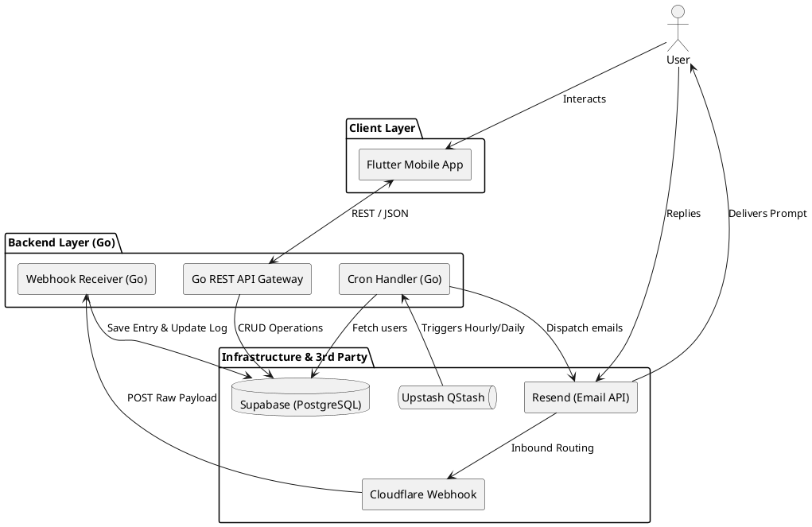

```plantuml
@startuml
!define RECTANGLE class
skinparam componentStyle rectangle
skinparam backgroundColor #FFFFFF
skinparam shadowing false

actor "User" as user

package "Client Layer" {
  [Flutter Mobile App] as flutter
}

package "Backend Layer (Go)" {
  [Go REST API Gateway] as gateway
  [Cron Handler (Go)] as cronHandler
  [Webhook Receiver (Go)] as webhookHandler
}

package "Infrastructure & 3rd Party" {
  database "Supabase (PostgreSQL)" as supabase
  queue "Upstash QStash" as qstash
  [Resend (Email API)] as resend
  [Cloudflare Webhook] as cfWebhook
}

user -down-> flutter : Interacts
flutter <--> gateway : REST / JSON

qstash -down-> cronHandler : Triggers Hourly/Daily
cronHandler -down-> supabase : Fetch users
cronHandler -down-> resend : Dispatch emails
resend -up-> user : Delivers Prompt

user -down-> resend : Replies
resend -down-> cfWebhook : Inbound Routing
cfWebhook -down-> webhookHandler : POST Raw Payload
webhookHandler -down-> supabase : Save Entry & Update Log

gateway -down-> supabase : CRUD Operations
@enduml
```

